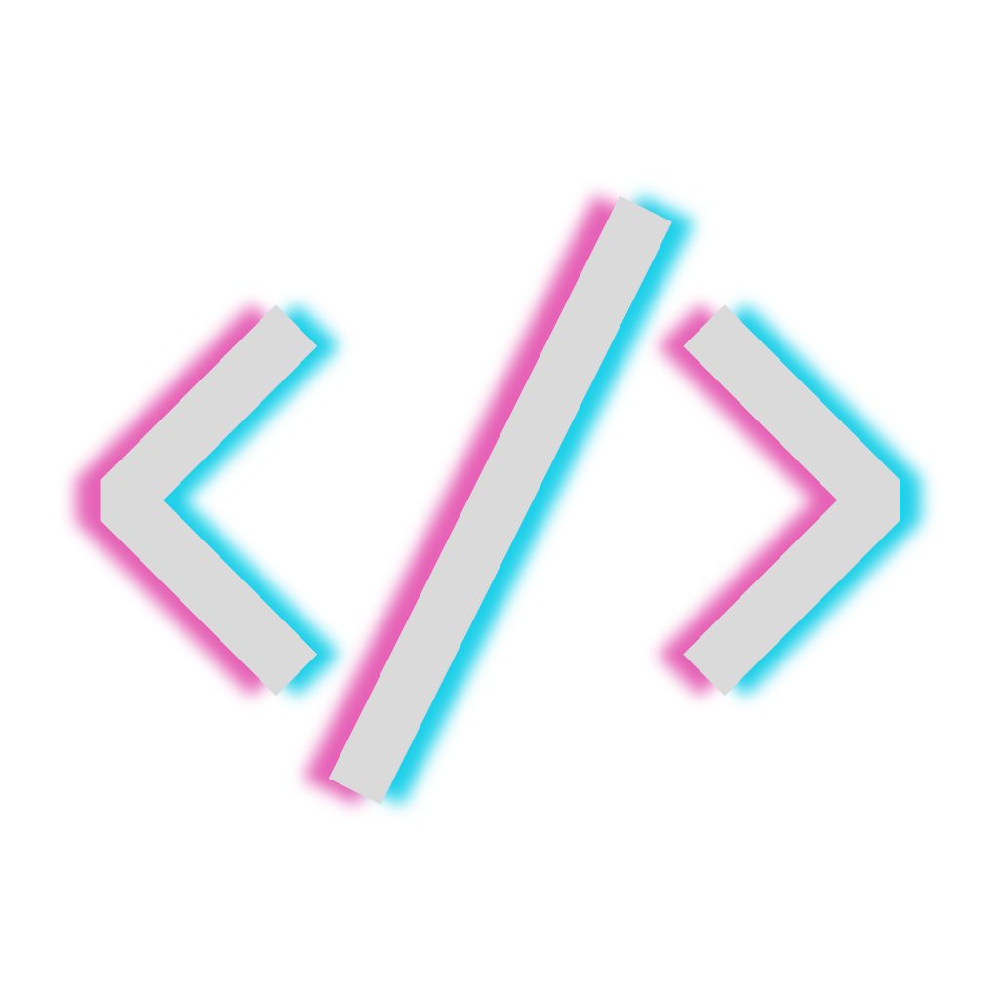

  
  <h2>Studio</h2>
  
Insert here a really cool motto

  <a href="https://github.com/leivaa21">
    -E662B6?style=for-the-badge"
      alt="Built for developers" />
  </a>
  
  

---

Table of contents

- [License](#license)

---

## License

This project is under a MIT license, so its open source and open for contributions :).
[More info about the license here](https://github.com/leivaa21/mono-studio/blob/master/LICENSE)
